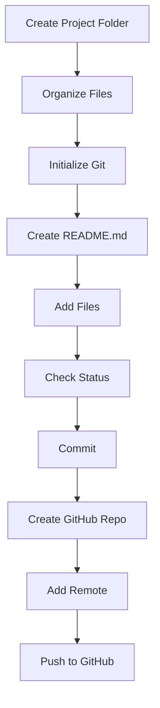

# Plan: Upload MCA Python Programming Project to GitHub

## Overview
This plan guides you through uploading your complete Python code project to GitHub from scratch. The repository will be named "MCA_Python_Programming_for_Problem_Solving" and contains academic MCA Python programs covering basics, functions, OOP, files, exceptions, and packages.

## Suggested Folder Structure for MCA Python Course
Based on the existing files, here's a clean structure to organize your project:

```
MCA_Python_Programming_for_Problem_Solving/
├── experiments/           # All experiment notebooks (exp_1.ipynb to exp_19.ipynb)
├── packages/              # Custom Python packages
│   └── shapes/            # Consolidated shapes package (choose class-based implementation)
│       ├── __init__.py
│       ├── circle.py
│       ├── rectangle.py
│       └── point.py       # If using class-based
├── data/                  # Data files like CSV and text files
│   ├── employees.csv
│   └── sample.txt
├── main.py                # Main script if applicable
└── README.md              # Project documentation
```

This structure groups related files logically, making the repository easy to navigate.

## Step-by-Step Guide

### 1. Create a Local Project Folder with Clean Structure
- Open terminal and navigate to your workspace: `cd "c:\Users\Keerti\OneDrive\Desktop\MCA 1sem"`
- Create the project folder: `mkdir MCA_Python_Programming_for_Problem_Solving`
- Change to the new folder: `cd MCA_Python_Programming_for_Problem_Solving`
- Create subfolders: `mkdir experiments packages\shapes data`

### 2. Organize Existing Files
- Copy experiment notebooks: Copy all `exp_*.ipynb` from `Keerti/Python/Lab assisment/` and `Keerti/Python/Pratical record/` to `experiments/`
- Copy data files: Copy `employees.csv` and `sample.txt` to `data/`
- Consolidate shapes package: Copy the class-based shapes from `Keerti/Python/Lab assisment/shape/` (includes point.py) to `packages/shapes/`
- Copy main.py: Copy `main.py` from `Keerti/Python/Lab assisment/` to the root

### 3. Initialize Git
- In the project folder: `git init`
- This creates a `.git` folder to track changes.

### 4. Create README.md
Create a file named `README.md` in the root with the following content:

```markdown
# MCA Python Programming for Problem Solving

This repository contains academic Python programs for MCA students, covering various topics in problem-solving.

## Topics Covered
- Python Basics
- Functions
- Object-Oriented Programming (OOP)
- File Handling
- Exceptions
- Packages and Modules

## Project Structure
- `experiments/`: Jupyter notebooks with experiments (exp_1 to exp_19)
- `packages/shapes/`: Custom shapes package with Circle, Rectangle, and Point classes
- `data/`: Sample data files for file handling examples
- `main.py`: Main script demonstrating key concepts

## How to Run
1. Ensure Python 3.x is installed
2. Install required packages if any (none currently)
3. Run notebooks in Jupyter or scripts via `python main.py`

## Author
Keerti Rao

```

### 5. Add All Files to Git
- Add all files: `git add .`
- This stages all files for commit.

### 6. Check Git Status
- Check status: `git status`
- Verify all files are staged (green) and no untracked files remain.

### 7. Commit the Code
- Commit with message: `git commit -m "Initial commit: Add MCA Python programming experiments and examples"`
- This saves the current state of the code.

### 8. Create GitHub Repository
Since we're using terminal commands only:
- Open your web browser and go to https://github.com
- Log in to your GitHub account
- Click "New repository"
- Name: `MCA_Python_Programming_for_Problem_Solving`
- Make it public
- Do NOT initialize with README (we already have one)
- Click "Create repository"
- Copy the repository URL (e.g., https://github.com/yourusername/MCA_Python_Programming_for_Problem_Solving.git)

### 9. Connect Local Repo to GitHub
- Add remote: `git remote add origin https://github.com/yourusername/MCA_Python_Programming_for_Problem_Solving.git`
- Replace `yourusername` with your actual GitHub username.

### 10. Push to GitHub
- Set main branch: `git branch -M main`
- Push: `git push -u origin main`
- This uploads your code to GitHub and sets up tracking.

## Example Commit Messages
- "Add basic Python syntax examples"
- "Implement OOP concepts with shapes classes"
- "Fix file handling exception in exp_5"
- "Update README with installation instructions"
- "Add new experiment on packages and modules"

## Common Errors and Fixes
- **Error: "fatal: remote origin already exists"**
  - Fix: `git remote remove origin` then add again
- **Error: "Permission denied (publickey)"**
  - Fix: Ensure you're using HTTPS URL or set up SSH keys
- **Error: "Updates were rejected because the remote contains work"**
  - Fix: Pull first with `git pull origin main --allow-unrelated-histories`
- **Error: "Nothing to commit, working tree clean"**
  - Fix: Make sure files are modified or use `git add .` if not staged
- **Error: "Repository not found"**
  - Fix: Check repository URL and ensure it exists on GitHub

## Workflow Diagram


This plan ensures a clean, organized repository ready for academic use.
